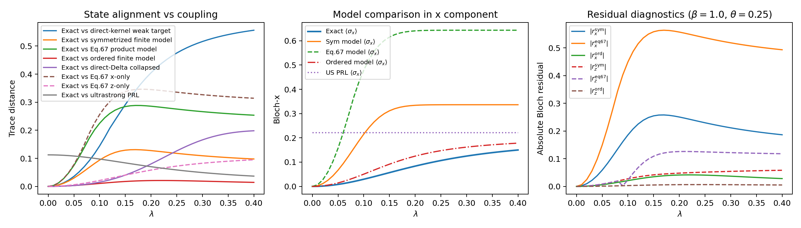
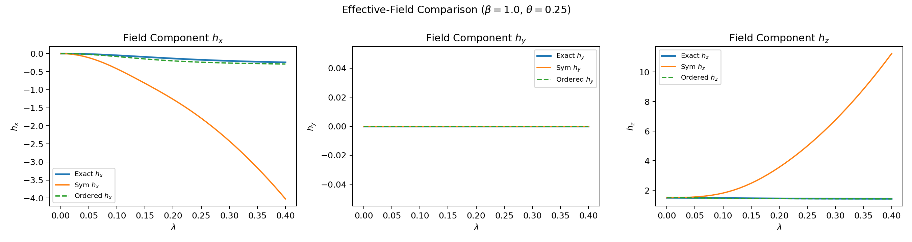

# PRL127 Analytic Bridge Diagnostics

## Run Configuration
- `beta`: 1.0
- `omega_q`: 3.0
- `theta`: 0.25
- `lambda_range`: [0.0, 0.4] with 41 points
- `n_modes`: 2, `n_cut`: 4
- `v4_lambda_map`: lam2
- `v4_kernel_mode`: formula

## Key Metrics
- Sym model max trace distance: `0.130964`
- Sym model endpoint trace distance: `0.097693`
- Eq67 model max trace distance: `0.288376`
- Ordered model max trace distance: `0.021051`
- Sym non-Hermiticity max: `1.665e-16`
- Eq67 non-Hermiticity max: `7.165e-01`
- Sym field MAE (hx, hy, hz): `(1.3772, 0.0000, 3.1110)`
- Ordered field MAE (hx, hy, hz): `(0.0454, 0.0000, 0.0104)`
- Max Bloch radius (exact, sym, ordered): `(0.905148, 1.000000, 0.905148)`
- Note: large field discrepancies can be amplified when |r| approaches 1, because h ~ arctanh(|r|)/|r|.

## Reference Plots

## Data Files
- Scan CSV: `C:\Users\gerar\VScodeProjects\Hamiltonian_of_mean_force\simulations\results\data\prl127_bridge_lam2_zoom_scan.csv`
- Summary CSV: `C:\Users\gerar\VScodeProjects\Hamiltonian_of_mean_force\simulations\results\data\prl127_bridge_lam2_zoom_summary.csv`
