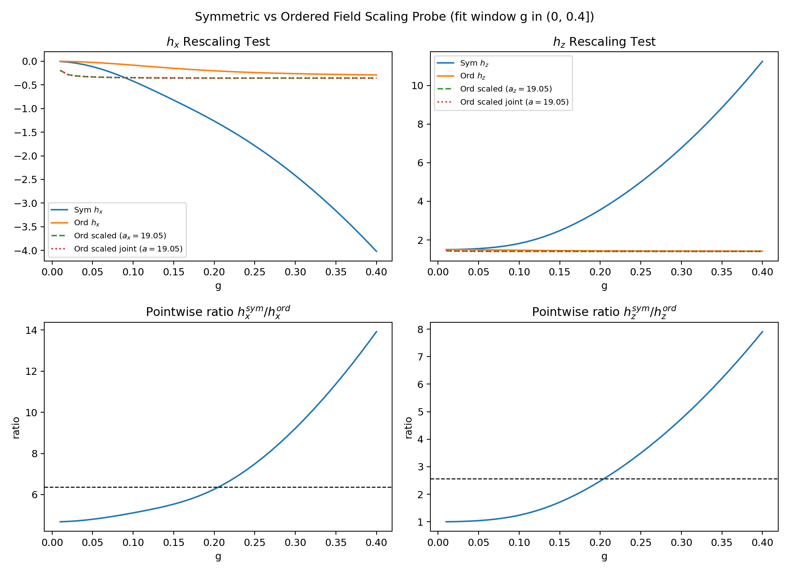

# Symmetric vs Ordered Scaling Probe (g_max=4, dense grid)

Fit window: `g in (0, 0.4]`

## Best Rescaling Factors (match sym(g) ~= ord(a g))
- `a_x` (from h_x only): `19.0495`
- `a_z` (from h_z only): `19.0495`
- `a_joint` (h_x and h_z together): `19.0495`

## Error Reduction vs No Rescaling (a=1)
- `h_x RMSE`: `1.763744` -> `0.425291`
- `h_z RMSE`: `4.415800` -> `0.959685`
- `joint normalized RMSE`: `2.067566` -> `0.474642`

## Pointwise Ratio Statistics (g in (0, 0.4])
- `h_x^sym / h_x^ord` median `6.3630` (10%-90%: `4.7953` to `11.9055`)
- `h_z^sym / h_z^ord` median `2.5725` (10%-90%: `1.0405` to `6.5628`)

## Figure

## Source Data
- `C:\Users\gerar\VScodeProjects\Hamiltonian_of_mean_force\simulations\results\data\prl127_scaling_probe4_scan.csv`
