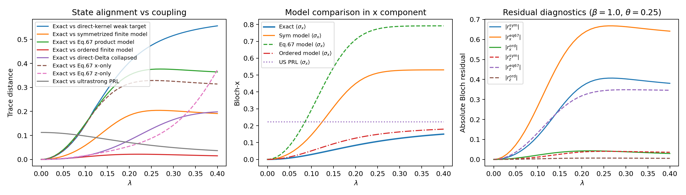
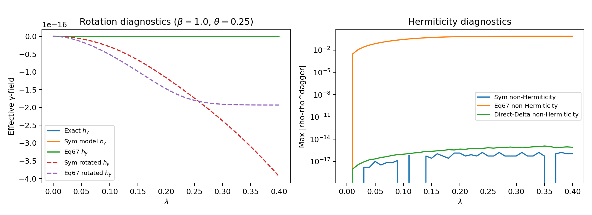
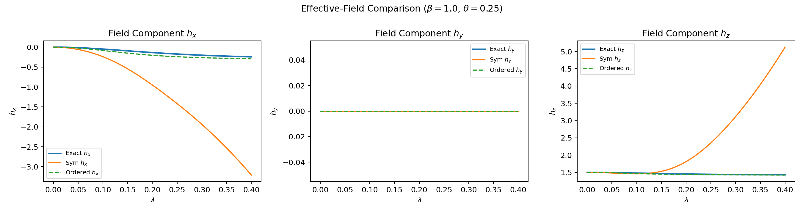

# PRL127 Analytic Bridge Diagnostics

## Run Configuration
- `beta`: 1.0
- `omega_q`: 3.0
- `theta`: 0.25
- `lambda_range`: [0.0, 0.4] with 41 points
- `n_modes`: 2, `n_cut`: 4
- `v4_lambda_map`: lam2
- `v4_kernel_mode`: formula
- `v4_kernel_scale`: 0.500000
- `v4_delta_sign_x`: 1.000
- `v4_delta_sign_z`: -1.000
- `q_reorg`: 45.514959

## Kernel Consistency Checks
- `int_0^beta K_0(u) du` (direct): `91.029920`
- `2 q_reorg` (expected): `91.029918`
- Relative mismatch for `int K`: `1.651e-08`
- `K_eff` base from closed formula: `275.142844`
- `K_eff` base from direct Eq.63 double integral: `275.142992`
- Relative mismatch for `K_eff`: `5.373e-07`

## Key Metrics
- Sym model max trace distance: `0.204393`
- Sym model endpoint trace distance: `0.191180`
- Eq67 model max trace distance: `0.376527`
- Ordered model max trace distance: `0.021694`
- Sym non-Hermiticity max: `1.665e-16`
- Eq67 non-Hermiticity max: `7.165e-01`
- Sym field MAE (hx, hy, hz): `(1.0379, 0.0000, 0.9476)`
- Ordered field MAE (hx, hy, hz): `(0.0469, 0.0000, 0.0108)`
- Max Bloch radius (exact, sym, ordered): `(0.905148, 0.999989, 0.905148)`
- Note: large field discrepancies can be amplified when |r| approaches 1, because h ~ arctanh(|r|)/|r|.
- First nonzero coupling sample: `g=0.010000`, `lambda_paper=0.000100`, `K_eff=0.013757`

## Reference Plots

## Data Files
- Scan CSV: `C:\Users\gerar\VScodeProjects\Hamiltonian_of_mean_force\simulations\results\data\prl127_signcheck_scale05_zflip_scan.csv`
- Summary CSV: `C:\Users\gerar\VScodeProjects\Hamiltonian_of_mean_force\simulations\results\data\prl127_signcheck_scale05_zflip_summary.csv`
